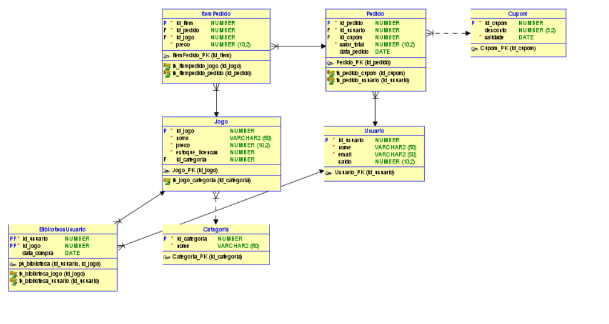

<div align="center">
  
  <h1>ZenixGames</h1>
  <p><b>Plataforma de Venda e Distribuição de Jogos Digitais</b></p>

  [](https://www.oracle.com/database/)
  [](#)
  [](#)
  [](#)
</div>

<br>

> **Instituição:** Instituto Federal <br>
> **Disciplina:** Banco de Dados II <br>
> **Atividade:** Trabalho Final <br>

---

## 👥 Equipe Desenvolvedora

**Arthur Christhopher Pires Dutra**  <br>
**Hugo Pereira Pinhata**  <br>
**Pedro Cabelo Ferreira** <br>
**Raissa Santana da Silva**  <br>
---

### 1.Procedures
* As compras e estornos foram envelopados em **Procedures** (`prc_realizarCompra`, `prc_cancelarCompra`).
* Utilizamos os comandos `COMMIT` e `ROLLBACK` para criar blocos transacionais atômicos (ACID). Se houver uma falha ao adicionar o jogo na biblioteca do cliente, o débito na carteira é automaticamente desfeito.

### 2.Triggers
Implementamos **Triggers** de gatilho (`BEFORE INSERT` / `BEFORE UPDATE`) para atuar como guardiões da integridade:
* **`trg_verificar_saldo`:** Bloqueia imediatamente qualquer inserção de pedido se o valor final ultrapassar o saldo disponível na carteira do usuário.
* **`trg_impedir_jogo_duplicado`:** Consulta a biblioteca antes de aprovar a transação, disparando uma exceção caso o usuário tente comprar um jogo que já possui.
* **`trg_adicionar_biblioteca`:** Após a confirmação do pagamento, automatiza a inserção do título na tabela de biblioteca do cliente e reduz a licença do estoque.

### 3. DCL (Data Control Language)
Para simular um ambiente corporativo real, o acesso não é feito via usuário `root/system`. Foram criadas *roles* específicas:
* **`role_zenix_admin`:** Possui privilégios de `INSERT`, `UPDATE` e `DELETE` em todo o catálogo de jogos e gestão de usuários.
* **`role_zenix_app`:** Restrito à execução de compras, aplicação de cupons e leitura da biblioteca.

---

## Requisitos Funcionais Implementados

- [x] **RF01:** Cadastro seguro de usuários integrando uma carteira virtual monetária.
- [x] **RF02:** Gestão do catálogo com relacionamento N:M para categorias de jogos e controle de chaves de ativação (estoque).
- [x] **RF03:** Processamento financeiro atômico (débito de saldo proporcional ao valor do carrinho).
- [x] **RF04:** Validação automática de fundos antes do faturamento do pedido.
- [x] **RF05:** Prevenção de duplicidade de jogos na biblioteca (Unique Constraint + Trigger).
- [x] **RF06:** Motor de cupons de desconto, considerando percentuais e datas de validade (`SYSDATE`).
- [x] **RF07:** Rotina de auditoria e cancelamento de pedidos (estorno financeiro, devolução de licença e revogação de acesso).

---

## Principais Casos de Uso 

1. **Comprar Jogo (UC01):**
   * *Fluxo:* Cliente escolhe o jogo -> Aplica Cupom (Opcional) -> Sistema valida Estoque -> Sistema valida se já possui o jogo -> Sistema checa Saldo -> Debita Saldo -> Deduz Estoque -> Adiciona à Biblioteca.
2. **Cancelar Pedido / Estorno (UC02):**
   * *Fluxo:* Admin/Sistema localiza ID do Pedido -> Estorna valor total para a carteira -> Repõe +1 no estoque -> Deleta registro da biblioteca do cliente -> Altera status do pedido para 'Cancelado'.
3. **Aplicar Cupom (UC03):**
   * *Fluxo:* Valida código (`UPPER()`) -> Verifica se `data_validade >= SYSDATE` -> Calcula `valor_final = preco_base - (preco_base * desconto)`.
4. **Consultar Biblioteca (UC04):**
   * *Fluxo:* *View* ou *Cursor* listando os nomes dos jogos, data de aquisição e tempo de jogo do cliente X.
5. **Gerenciar Catálogo (UC05):**
   * *Fluxo:* Admin insere `Jogo` -> Associa a `Categorias` -> Atualiza `Qtd_Licencas` disponíveis.

---

## Estrutura do Repositório

Organizamos o repositório de forma modular para facilitar a leitura e execução pontual de cada camada estrutural do banco.

```text
📁 ZenixGames
 ┣ 📂 scripts
 ┃ ┣ 📜 DDL.sql              # Criação das tabelas (CREATE TABLE), PKs, FKs e Constraints
 ┃ ┣ 📜 Dml.sql              # População inicial (INSERTs de jogos, usuários, categorias)
 ┃ ┣ 📜 DCL.sql              # Criação das roles de segurança e GRANTs
 ┃ ┗ 📜 Cursores.sql         # Relatórios dinâmicos (Top vendas, usuários mais ativos)
 ┣ 📂 Procedures
 ┃ ┣ 📜 Procedures.sql       # pacotes com prc_realizarCompra, prc_cancelarCompra
 ┃ ┗ 📜 testProcedures.sql   # Execuções simuladas (EXEC prc_...)
 ┣ 📂 Triggers
 ┃ ┣ 📜 Triggers.sql         # Gatilhos BEFORE/AFTER INSERT/UPDATE
 ┃ ┗ 📜 TestesTriggers.sql   # Scripts que forçam o disparo das triggers para validar os erros
 ┣ 📜 Diagrama.png           # Modelo Entidade-Relacionamento
 ┗ 📜 README.md              # Documentação oficial
```

---

## Como Executar o Projeto Localmente

Para rodar este banco de dados, você precisa de um ambiente **Oracle Database** (Oracle 11g, 19c, 21c ou Oracle Live SQL).

1. **Clone este repositório:**
   ```bash
   git clone https://github.com/RaissaSantana13/ZenixGames.git
   cd ZenixGames
   ```
2. **Abra seu cliente SQL (SQL Developer, DBeaver, SQL*Plus):**
   * Conecte-se com um usuário com privilégios de DBA (ex: `sys as sysdba`) para rodar os scripts iniciais.
3. **Ordem de Execução Recomendada:**
   * **1º** `scripts/DDL.sql` - Para montar a espinha dorsal do banco.
   * **2º** `scripts/Dml.sql` - Para inserir a massa de dados de teste.
   * **3º** `Procedures/Procedures.sql` e `Triggers/Triggers.sql` - Para compilar as regras de negócio.
   * **4º** `scripts/DCL.sql` - Para aplicar as permissões.
4. **Testes:** 
   * Utilize os arquivos `testProcedures.sql` e `TestesTriggers.sql` para ver o sistema barrando compras indevidas e aprovando compras corretas.
---

## Diagrama Entidade-Relacionamento

<div align="center">
  
</div>
